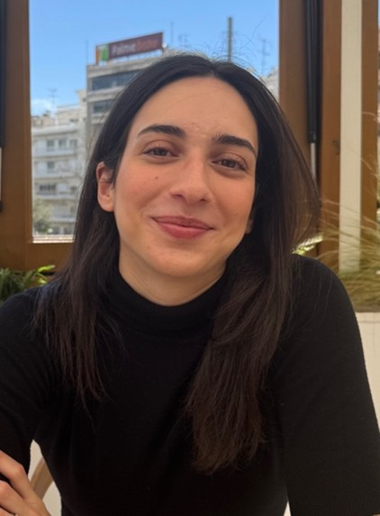
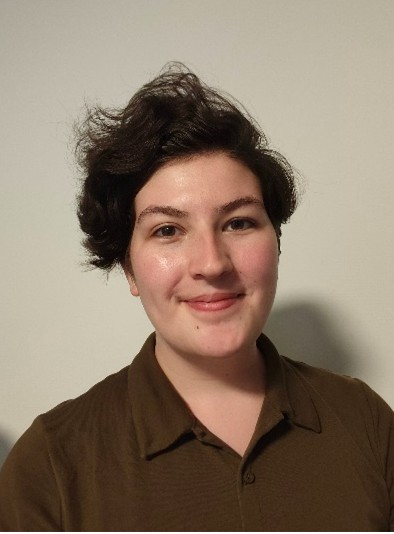
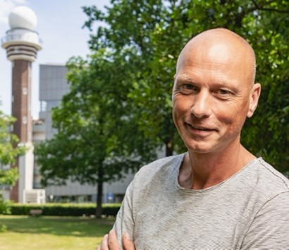
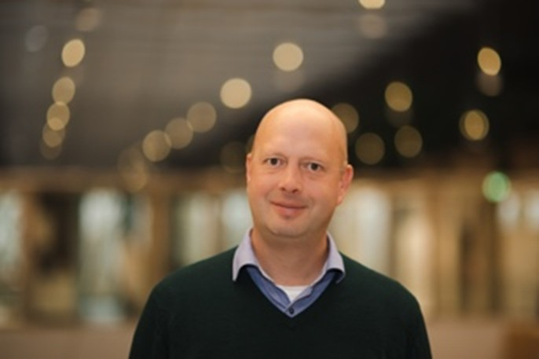
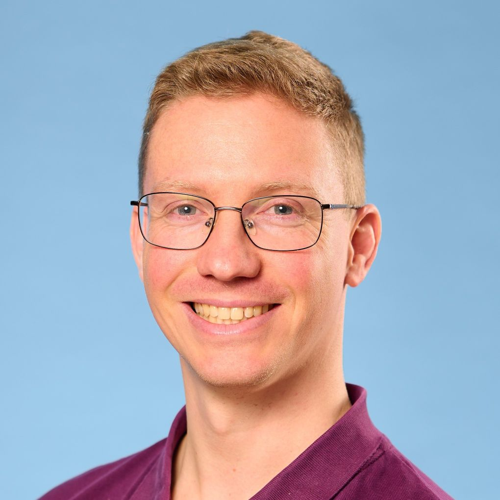
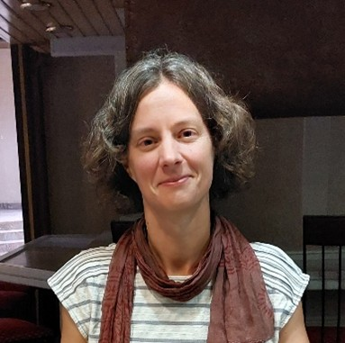
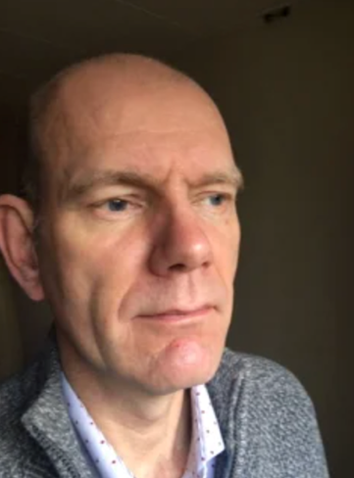
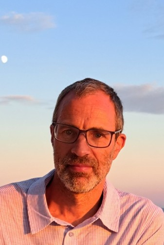

# Meet the INFLAMES-team

## MSc-students

<figure>

</figure>

Dimitra Kollia is pursuing her MSc in Earth and Environment at Wageningen University, with a specialization in Meteorology and Air Quality. In her thesis research, supervised by Dr. Folkert Boersma and Prof. Guido van der Werf, she investigates how satellite observations from TROPOMI can be used to improve fire emission factors of trace gases across different biomes. By comparing satellite-derived emission ratios with bottom-up inventories like GFED, her work aims to reduce uncertainties in global fire emission estimates and better quantify the atmospheric impacts of wildfires.

## PhD-students

<figure>

</figure>

Annabel Chantry is pursuing her PhD at the Royal Netherlands Meteorological Institute. Her PhD research, supervised by Dr. Martin de Graaf and Dr. Folkert Boersma, will focus on observations of smoke aerosols by TROPOMI, EarthCARE and SPEXone. By combining these instruments she aims to better characterize wildfire plumes and measure their aerosol direct radiative effect. Previously she studied Physics at the University of Oxford and worked at the European Space Agency on EarthCARE level 1 processing.

## Staff

<figure>

</figure>
 
Folkert Boersma (Project Lead, Wageningen University). Folkert Boersma is an Associate Professor at Wageningen University and a researcher at KNMI, specializing in satellite remote sensing of atmospheric composition. He has extensive experience in leading large research projects, through developing the OMI and TROPOMI NO₂ algorithms. He is using satellite observations of NO₂, HCHO, Solar-Induced Fluorescence (SIF), and aerosols to analyse fire plumes and quantify emissions, advancing our understanding of biomass burning impacts. His expertise bridges satellite data, atmospheric chemistry, and climate research, contributing to improved air quality and climate monitoring

<figure>

</figure>

Martin de Graaf (Lead WP2, KNMI). Martin de Graaf is specialising on the use of (hyper)spectral satellite remote sensing applications for the retrieval of aerosol properties and radiative effects in relation with clouds, from instruments like GOME, SCIAMACHY, OMI, MODIS, SEVIRI and TROPOMI. He led the Dutch contribution during two field campaigns to Ascension Island (2016-2017), combining satellite, in-situ aircraft, and ground-based lidar observations. He is part of the TROPOMI L2 team, the EarthCARE Cal/Val team, and scientific lead of the aerosol product development for the Sentinel-4 (S4) and Sentinel-5 (S5) satellite series. He leads a collaborative project with African partners to use TROPOMI data for urban and rural air quality monitoring in Zimbabwe. 
 
<figure>

</figure>

Otto Hasekamp (Lead WP4, SRON). Otto Hasekamp is senior scientist in the Earth Science Group of SRON. He specializes in radiative transfer modeling and inversion techniques for remote sensing of aerosols, cloud and atmospheric trace gases. He leads projects on aerosol retrieval from Multi-Angle Polarimetric (MAP) measurements, (POLDER, SPEXone, and airborne instrumentation), retrieval of cloud micro- and macro-physical properties from MAP and spectroscopic measurements, and the use of aerosol and cloud data to quantify the direct and indirect effect of aerosol on climate. He is PI for the SPEXone instrument on the NASA PACE mission and is a member of the ESA/EUMETSAT Science Advisory Group (SAG) of the 3MI instrument.

<figure>

</figure>

Gerbrand Koren (WPs 1/5/6, Utrecht University). Gerbrand Koren is an Assistant Professor at the Copernicus Institute of Sustainable Development at Utrecht University. He studies how land ecosystems and the climate influence each other, especially through droughts and wildfires. Using satellite data — such as photosynthesis indicators (SIF) — and computer models, he explores how vegetation and the atmosphere interact across tropical and northern regions. He develops satellite methods to study tropical ecosystems (NWO-funded project ACT-NOW), applies machine learning to carbon exchange (project EXCITED with the Netherlands eScience Center), and researches extreme events. Gerbrand is also a strong advocate for open science, contributing to data standards, public datasets, and open-source tools. Within INFLAMES, he focuses on vegetation research and community building.

<figure>

</figure>
 
Marloes Penning de Vries (Lead WP6, University of Twente). Marloes Penning de Vries is an Assistant Professor at the ITC faculty of the University of Twente. She is an atmospheric scientist with keen interest in interdisciplinary projects. Her research is aimed at finding novel applications of satellite measurements of the atmosphere to address current problems involving air and water quality, health, and effects of climate change. Marloes leads the co-creation project “WHYimprove” on water quality of Lake Chivero (Zimbabwe), jointly funded by NWO and NRF (South African Research Fund). She is a collaborator in AQ4Zim: a project funded within the EOAFRICA framework with the aim to improve air quality monitoring in Zimbabwe on the ground and from satellite, led by co-applicant Martin de Graaf. Apart from conducting research, Marloes is involved in educational activities and supervision of MSc and PhD students.
 
<figure>

</figure>

Nick Schutgens (Lead WP3, VU Amsterdam). Nick Schutgens is Assistant Professor at the VU. He studies how tiny airborne particles (aerosols), especially those from wildfires, affect the climate and air quality. To do this, he combines computer models with satellite observations to better understand and reduce errors in how these particles are represented. He has developed new methods to estimate where aerosols come from and to make existing climate models more accurate. He works closely with international modelling communities (AEROCOM, AEROSAT, and ECHAM-HAM) and serves on AEROCOM’s scientific steering committee. Nick is also a guest researcher at SRON and collaborates with TNO to improve the LOTOS-EUROS air quality model.

<figure>

</figure>
 
Peter van Bodegom (Lead WP5, Leiden University). Peter van Bodegom is Professor Environmental Biology at Leiden University. He has 30 years of experience in deriving emission estimates (primarily CH₄ and CO₂) from land surfaces and vegetation. He developed traits-based approaches for understanding vegetation interactions with soil and climate. He has been working on improving the representation of biodiversity in climate-vegetation models and is one of the founding fathers of traits-based approaches in dynamic vegetation models (DVMs). He builds and analyses global databases of vegetation traits, including those related to fire. He links results from those analyses to DVMs and to improve the retrieval of biophysical parameters from satellites and other remote sensing tools.
